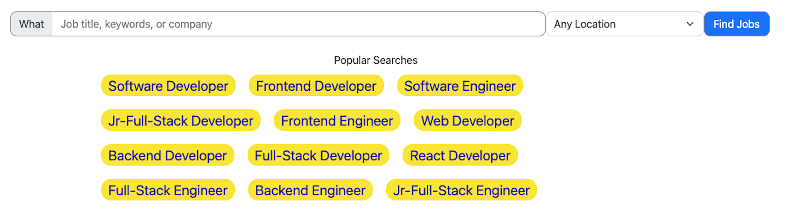
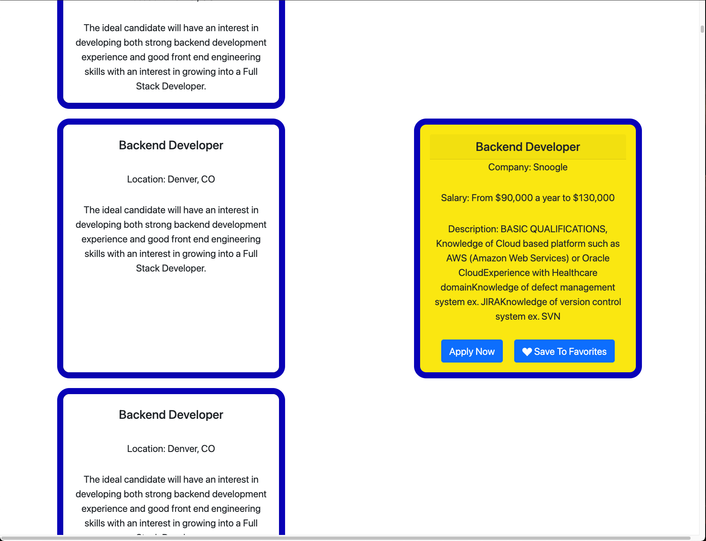

# Indubitably Jobs 

## indeed.com-inspired Job Search Application

Unemployed?  Want a job?  Need help tp find one?  
"Indubitably!"

 
 
Search for any of the 'Popular Search' tech jobs listed on the home page by
either typing one of these searches in the search bar or clicking on that particular "popular search" button itself

 
 
## Register/Sign In to save your favorite jobs!
Any user can search for jobs.  'Register/Sign In' page allows the user to make an account by entering their information into the required fields.  After the user submits their information, The password is hashed using bcrypt and the user account is saved in a PostgreSQL relational database. Upon making an account and signing in, the user gains the ability to save jobs to their account as favorites.  

 
 
By typing in one of the popular searches and/or selecting a location and pressing the "Find Jobs" button, you are taken to a 'Jobs'  page that displays the selected results.  Clicking on any of the job listings will reveal more information about that listing.  If a user is logged in, an button option to save that job listing as a favorite will also appear. 

 
 
Clicking on the 'Favorites' link atop the page at any point will bring the user to their favorites page, where any jobs they have elected to save will be displayed.  Clicking on any of the job listings will reveal more information about that listing.  All users, jobs, and any saved favorites are related in a PostgreSQL database. 

# Languages & Tech
<pre>
JavaScript 
Node.js
PostgreSQL
bcrypt
HTML
CSS
Sequelize
Beekeeper
Npm
Nodemon
Express
VSCode
</pre>

